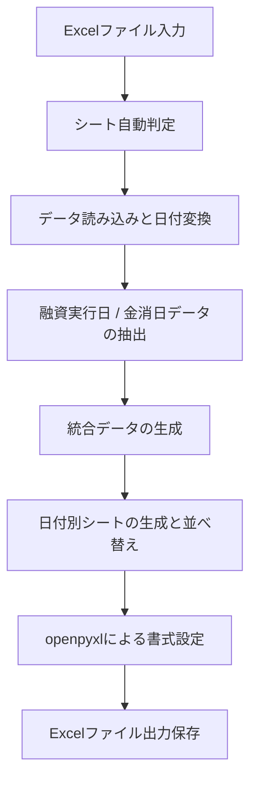

# sort_excel

Excelファイルの受諾確認票などのシートを読み込み、用途別に整形 / 並べ替え / 書式設定を行って出力するデスクトップアプリケーションです。
画面から担当順やソートキーを変更でき、設定を保存して繰り返し利用できます。

## 主な機能

* デスクトップGUI画面
  * Python標準のTkinterをベースに設計しており、軽快に動作します。
  * ファイル選択ダイアログのほか、ドラッグ / ドロップによるファイル読み込みにも対応しています。
  * 処理の進捗ログが画面上に表示され、完了後は保存先フォルダや出力ファイルをそのまま開くことができます。

* 担当順の調整と保存
  * 日付別シートのソートに使用する担当者の優先順位を並べ替えることができます。
  * 担当者の追加、名前変更、削除、五十音順ソート、初期値へのリセットに対応しています。
  * 変更した設定はJSONファイルに保存され、次回起動時にも自動的に反映されます。

* ソート条件と出力シートのカスタマイズ
  * 日付別シート内の並べ替えキーを最大3つまで指定でき、昇順 / 降順を選択できます。
  * 融資実行日シート、金消日 / 面談日シート、統合データシート、日付別シートの出力有無を個別に切り替えられます。
  * 行の高さや列幅などの表書式設定を調整できます。

* 自動書式設定
  * 文字がセルからはみ出さないよう、縮小して全体を表示する設定を適用します。
  * すべてのセルの外枠と内枠に点線罫線を付与します。
  * 行の高さを25に統一し、上下左右中央揃えを適用します。
  * 列の種類に応じた見やすい幅を自動設定します。

## 画面構成と使い方

### GUIでの操作

実行ファイルである sort_excel.exe をダブルクリックするか、以下のコマンドを実行して起動します。

```bash
python sort_excel.py
```

* 並べ替え実行タブ
  * 入力ファイルを選択するか、ドロップ領域へExcelファイルをドラッグします。
  * 保存先ファイル名は自動で設定されますが、必要に応じて変更も可能です。
  * 並べ替えを実行するボタンを押すと処理が開始されます。

* 担当順の設定タブ
  * 日付別シートで優先する担当者リストを編集します。
  * 上にある担当者ほど優先的に上に並びます。
  * 未登録の担当者は末尾に配置されます。

* ソート設定タブ
  * 日付別シート内の第1キーから第3キー（識別、担当、時間など）と昇順 / 降順を設定できます。
  * 出力するシートの種類を選択できます。

### コマンドラインやドラッグでの操作

引数としてExcelファイルのパスを渡すと、ファイルを読み込んだ状態でGUIが起動します。
また、exeファイルに対してExcelファイルを直接ドラッグ / ドロップして開くことも可能です。

```bash
python sort_excel.py <Excelファイルパス>
```

付属の sort_excel.bat にExcelファイルをドラッグ / ドロップして実行することもできます。

## 処理の流れ



## コード解説とモジュール構成

プロジェクトは保守性と拡張性を考慮し、役割ごとにモジュールを分離しています。

* sort_excel.py
  * プログラム全体のエントリーポイントです。
  * コマンドライン引数を解析し、GUIの起動やファイル読み込みの橋渡しを行います。

* gui_app.py
  * Tkinterを使用したGUI画面の実装です。
  * 並べ替え実行、担当順設定、ソート設定の各タブUIを提供します。
  * 画面の固まりを防ぐため、Excel処理はバックグラウンドスレッドで実行され、進捗メッセージをログ領域に逐次表示します。
  * windndライブラリが利用可能な場合は、ウィンドウへのドラッグ / ドロップによるファイル読み込みを有効化します。

* sort_core.py
  * Excelデータの読み込み、整形、並べ替え、書式適用を担当するコアエンジンです。
  * シート検出ロジックでは、受諾確認票、受託確認票、Sheet1、シート1の順に対象シートを探索し、見つからない場合は先頭シートを採用します。
  * Pandasを用いて融資実行日データと金消日面談日データを抽出し、標準化された列順序に揃えて統合します。
  * 日付ごとのシートでは、設定された優先キーに基づいて行を並べ替えます。
  * 書式設定処理ではopenpyxlを使用し、全セルへ点線罫線、上下左右中央揃え、縮小表示、列幅および行の高さを適用します。

* config_manager.py
  * 担当者リストやソート条件、書式設定などの永続化を担当します。
  * 通常のスクリプト実行時とexe実行時の両方で、適切なファイルパスを自動判定して sort_excel_config.json へ読み書きします。
  * 設定ファイルが存在しない場合や破損している場合は、安全に初期値へ戻します。

* sort_excel_config.json
  * ユーザーが保存した設定値を保持するJSONファイルです。
  * 担当者の並び順、ソートキー、シート出力オプション、書式設定値が保存されます。

* sort_excel.spec
  * PyInstaller用のビルド構成ファイルです。
  * 配布用exeのファイルサイズを軽量化するため、torchやscipy、matplotlibなどの不要な重いモジュールを除外設定しています。
  * 単一の実行ファイルとして配布できるよう構成されています。

## データ仕様

### 対象シートと主要列

入力ファイルでは以下のいずれかのシート名が自動認識されます。

* 受諾確認票 / 受託確認票 / Sheet1 / シート1

想定している入力列は以下の通りです。

* 融資実行日、金消日・面談日
* 形態、お客様氏名、物件、依頼内容、担当、管轄
* 立会時間、立会場所、立会者、当日申請
* 金消時間、金消場所・面談場所、意思確認

### 出力されるシート

* sorted_by_融資実行日 : 融資実行日順に並べ替えたシート
* sorted_by_金消日・面談日 : 金消日・面談日順に並べ替えたシート
* 統合データ : 融資実行日と金消日の両データを日付昇順で統合したシート
* 各日付シート : 統合データを日ごとに分割し、指定された優先順位でソートしたシート

### 自動適用される書式

* セル配置 : 上下中央揃え / 左右中央揃え
* セル書式 : 縮小して全体を表示
* 罫線 : すべてのセル枠に点線罫線
* 行の高さ : 25
* 既定列幅 : 
  * お客様氏名 : 約115px
  * 物件 : 約160px
  * 場所 : 約160px
  * その他の列 : 約80px

## 配布用 exe の作成方法

PyInstallerを利用して、Python未導入のPCでもそのまま起動できる単一のexeファイルを作成できます。

```bash
pyinstaller --clean sort_excel.spec
```

ビルドが完了すると、dist/sort_excel.exe が生成されます。

## トラブルシューティング

* シートが見つからないエラーが出る場合
  * Excelファイル内に対象シートが含まれているか確認してください。
* 時間列の並び順が期待通りにならない場合
  * HH:MM や H:MM:SS 形式の文字列であれば自動で秒数換算して並べ替えます。判定できない特殊な形式の場合は末尾に配置されることがあります。
* 列幅がExcel上でわずかに異なって見える場合
  * Excel内部の文字幅単位への近似換算を行っているため、使用フォントや環境により多少の差異が発生する場合があります。

## ライセンス

MIT License
